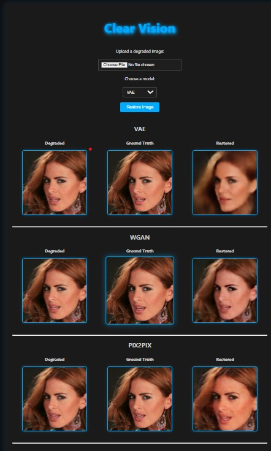
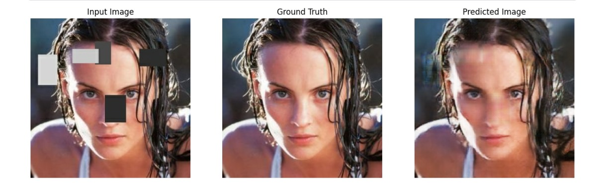

# Clear Vision: Image Restoration with Deep Learning

Clear Vision is a deep learning project for **image restoration**. It aims to restore degraded or low-quality images using state-of-the-art generative models, including **Pix2Pix**, **Variational Autoencoder (VAE)**, and **Wasserstein GAN (WGAN)**. This project demonstrates multi-model inference, real-time predictions, and high-quality image reconstruction.

---

## 🚀 Deployed Demo

*Currently, the project is designed for local inference. Future deployment on web platforms like Streamlit or Hugging Face Spaces is possible.*

*Sample Output (screenshot):*

---

*Pix2Pix retains the maximum structural similarity and works the handles occlusion the best among the 3 models (screenshot):*

---

## Table of Contents
- [Overview](#overview)
- [Dataset & Evaluation](#dataset--evaluation)
- [Use Case](#use-case)
- [Features](#features)
- [Architecture](#architecture)
- [Setup & Installation](#setup--installation)
- [Usage](#usage)
- [Models](#models)
- [Project Structure](#project-structure)
- [Requirements](#requirements)
- [Acknowledgements](#acknowledgements)
- [License](#license)

---

## Overview

Image restoration is crucial for applications like photography enhancement, medical imaging, satellite imagery, and historical photo reconstruction.  
This project provides a **flexible framework to restore images** using three complementary models:

- **Pix2Pix**: Conditional GAN for image-to-image translation
- **VAE**: Probabilistic model capturing global features
- **WGAN**: Stable GAN architecture for high-quality generative outputs

The models are trained and evaluated on **30,000+ CelebA-HQ images**, showing effective restoration performance.

---

## Dataset & Evaluation

- **Dataset:** CelebA-HQ (30K+ images)  
- **Task:** Degraded-to-clean facial image restoration  
- **Evaluation Metrics:**
  - **PSNR:** 21.47  
  - **SSIM:** 0.635  
  - **LPIPS:** 0.404  

- **Pix2Pix performs the best for degraded images with occlusion**, maintaining maximum structural similarity.  
- VAE is effective at global reconstruction but **does not retain structural details at all**.

---

## Use Case

- Restoration of degraded facial images  
- Designed specifically for **face detection and facial reconstruction**, leveraging structural and pixel-level details  
- Can be extended to other domains such as medical imaging, satellite imagery, or general object restoration when trained on the corresponding datasets  
- Enhancing low-quality photographs or scans for visual clarity  
- Preprocessing images for downstream tasks (e.g., classification, object detection)  
- Demonstrating modern generative techniques in computer vision for portfolio or research purposes

---

## Features

- Multi-model image restoration pipeline (Pix2Pix, VAE, WGAN)  
- Automatic preprocessing and postprocessing of images  
- Support for local inference via Python scripts  
- GPU and CPU support for flexible deployment  

---

## Architecture

- **Backend**: Python scripts with PyTorch and TensorFlow  
- **Models**: Pix2Pix (TF), VAE (PyTorch), WGAN (PyTorch)  
- **Preprocessing**: Resize, normalize, batch dimension  
- **Postprocessing**: Denormalization, conversion to PIL/OpenCV format

## Setup & Installation

1. **Clone the repository**
```bash
git clone https://github.com/archis100/Clear-Vision-Final.git
cd Clear-Vision-Final
```
2. **Install dependencies:**
```powershell
pip install -r requirements.txt
```
3. **Download models:**
- VAE: `models/vae.pth`
- WGAN: `models/wgan.pth`
- Pix2Pix: `models/pix2pix/` folder with `saved_model.pb` and `variables/`
  (These files are tracked with Git LFS due to large size)

## Usage
### Run App
```powershell
cd Clear-Vision-Final
python main.py
```

## Project Structure
```
CLEAR-VISION-FINAL/
├── .gitattributes
├── .gitignore
├── assets/               # Screenshots or demo images
├── main.py               # Entry point for running the app or inference
├── models/               # Saved models and checkpoints (LFS tracked)
│   ├── __init__.py
│   ├── degradation.py    # Script for creating degraded images
│   ├── generator.py      # Generator architecture
│   ├── inference.py      # utility function
│   ├── pix2pix/
│   ├── pix2pix_model.py  # Pix2Pix model class and utilities
│   ├── vae.pth
│   ├── vae_model.py      # VAE model class and utilities
│   ├── wgan.pth
│   └── wgan_model.py     # WGAN model class and utilities
├── requirements.txt      # Python dependencies
├── README.md             # Project documentation
├── static/               # Static files for input/output management
│   ├── outputs/
|   |   ├── degraded/     # Store degraded images
│   │   └── restored/     # Store restored images
│   ├── style.css
│   └── uploads/          # Uploaded images for restoration
└── templates/
```

## Requirements
See `requirements.txt` for all dependencies. Key packages:
- Python
- tensorflow
- torch, torchvision
---

## Acknowledgements
- Developed for Coding Club Even Semester Project, IIT Guwahati
- Pix2Pix Paper: [tensorflow/pix2pix](https://www.tensorflow.org/tutorials/generative/pix2pix)
- CelebA-HQ Dataset: [kaggle](https://www.kaggle.com/datasets/badasstechie/celebahq-resized-256x256)

## License
This project is for educational and research purposes.
